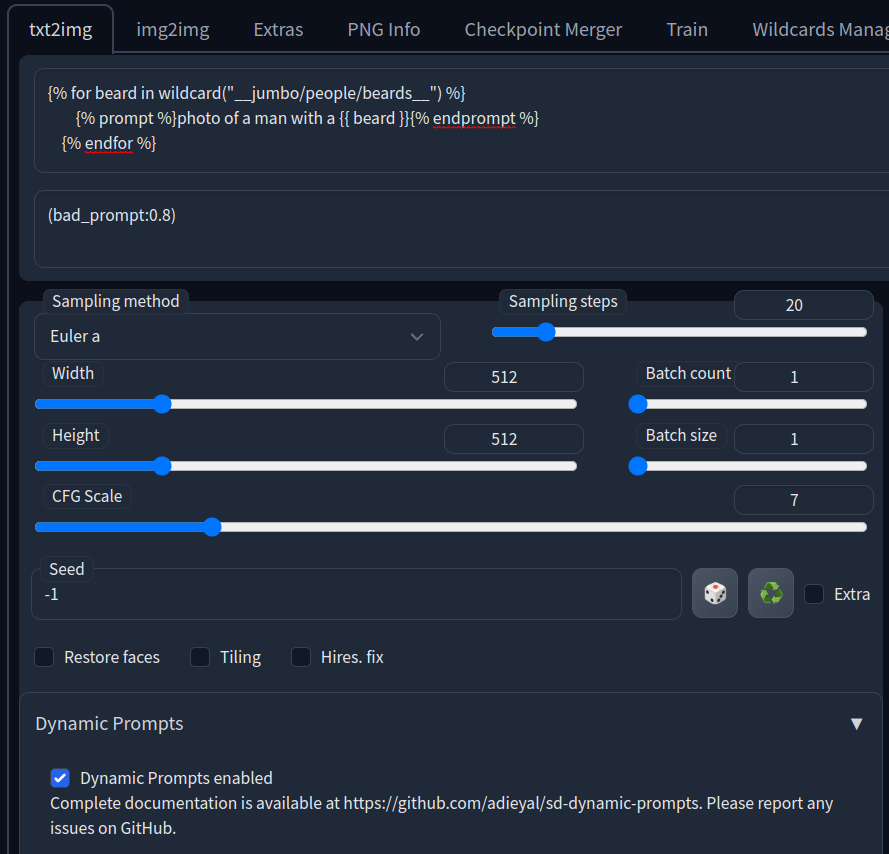
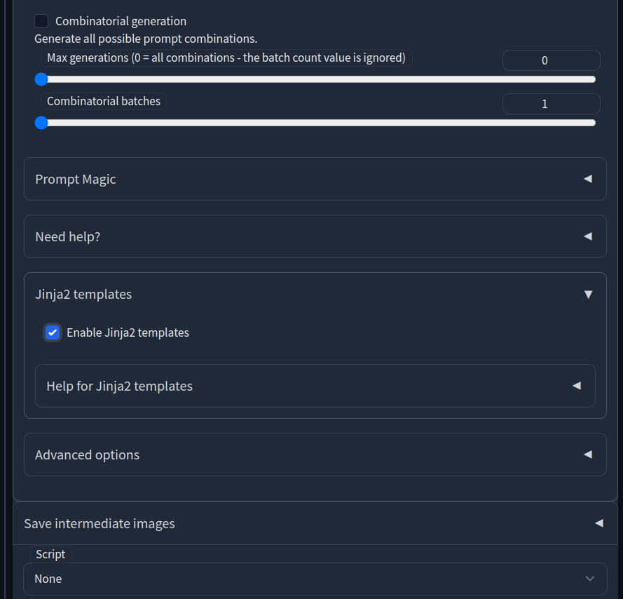

# Stable Diffusion AI Prompt Examples

## What is this?
Prompts can be hard.  There's so many tokens to try and it can take a long time to figure out which one will get you what you're after.  I wanted to have a place where I could easily see examples of different tokens in use, so here we are.

## How to use
Star and/or bookmark this page so you can find it later.  Then browse the folders to the prompts you're after or just search this repository using the GitHub search box at the top left.  These folders are organized following the structure in the [Wildcards](https://github.com/AUTOMATIC1111/stable-diffusion-webui-wildcards) they came from.

## How to contribute
1. Fork this repository
2. Generate examples using the format below (or close to it)

