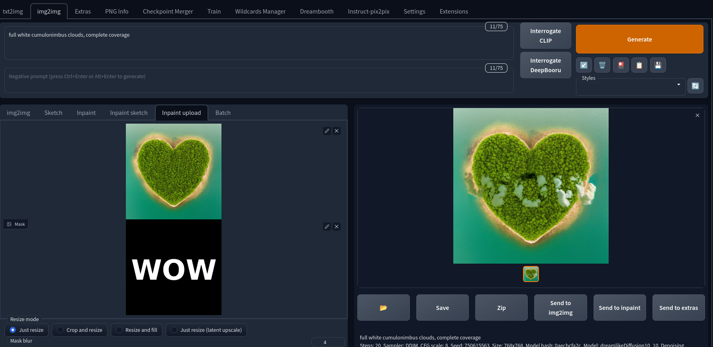
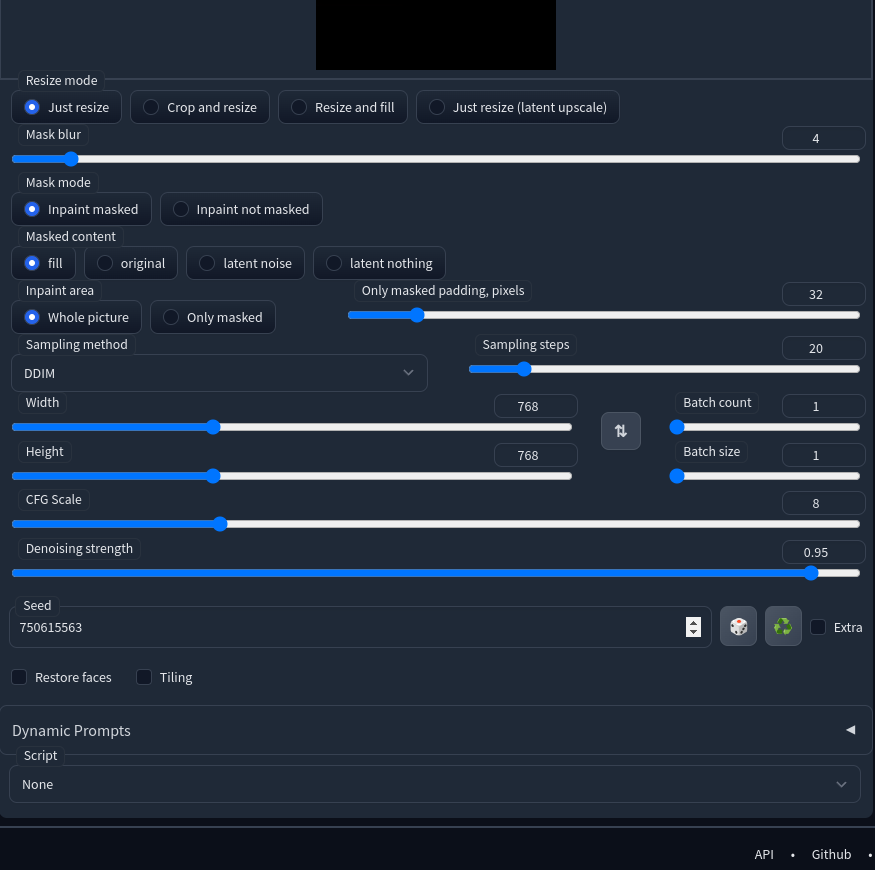
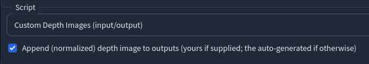
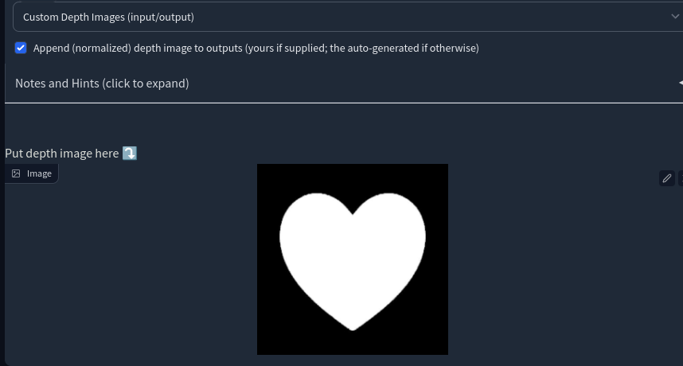
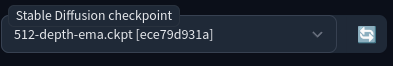
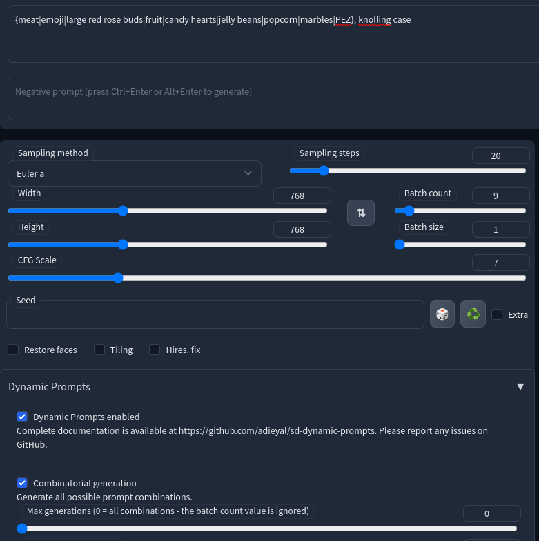
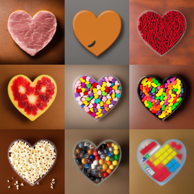

# Masks
There are two main ways to use image masks in Stable Diffusion Web UI.  The first is by uploading a mask in img2img to assist with modifications.  The second is to use masks in your initial prompt with the help of an added script.  Let's take a look at how these work.

For these examples, we'll use an image mask and a text mask.  Both are fairly easy to create and there are many tutorials, so check Google if you're not sure how to make one.

----
## im2img Inpainting Mask
This one is built-in, so we'll start here.  For this method, you'll need an existing image.  I like to start with a prompt like "top down view of a city".  For my example, I used the method below to create a heart-shaped island in the ocean as my base image.  From there, I used my mask to overlay clouds on top.  I consider myself still very much a novice at inpainting, so after trying many settings changes, I settled on this result.

Here's how I got there.

1. I dragged in the base image to the top
2. I dragged in my mask image to the bottom
3. I added my prompt and set the padding and blur conservatively
4. Use x/y plot script to try some things out (a lot)

If this image were for more than an example page, I'd probably dive in a little more to get the clouds to fill the "WOW" space more, but this is good enough.

----

## txt2img Mask
The first thing you have to do is install [this script](https://github.com/AnonymousCervine/depth-image-io-for-SDWebui), [the model](https://huggingface.co/stabilityai/stable-diffusion-2-depth), and [the yaml](https://raw.githubusercontent.com/Stability-AI/stablediffusion/main/configs/stable-diffusion/v2-midas-inference.yaml).  [This video](https://www.youtube.com/watch?v=sNcEhR65pw0) has pretty good instructions on how to do it.

1. Scroll down to the bottom and select "Custom Depth Images (input/output)" in the "Script" dropdown.

2. Select/drag/paste your mask image into the box that appears.

3. Be sure you have the right model selected or you'll get unexpected resutls with no masking.

4. Now add whatever prompt you want.  I used Dynamic Prompts to generate a bunch of quick ideas that I can expand on.

5. Generate your images

That's it.  I'll happily accept corrections or requests for other tutorials.